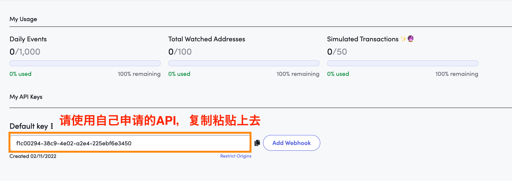
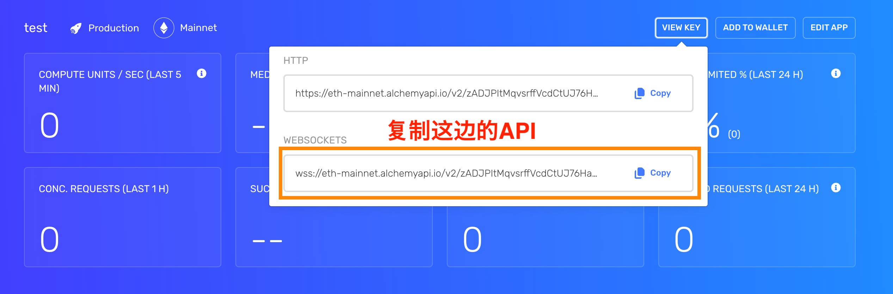
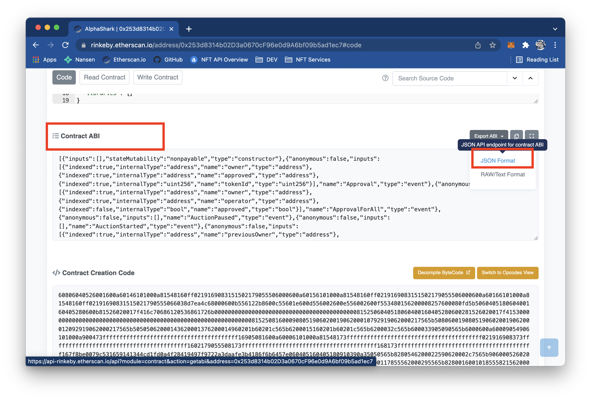

# 执行步骤
## 安装 yarn
sudo npm install --global yarn
## 安装需要的package
yarn install
## 执行bot
node main.js

# 注意事项：
1. 同一个区块mint仅在主网能够实现，测试网无法测试。请大家先找便宜的主网项目进行测试
2. 同一个区块监听需要用到blocknative的API，需要大家自行申请
3. 同一个区块对网速要求极高，在我们的测试中成功率也不算太高，建议使用blocknative的199USD版本以上的API来减少延迟·

# 参数设置：

## .env 文件

### BN_DAPPID
前往 [https://explorer.blocknative.com/account](https://explorer.blocknative.com/account)注册blocknative账户
将API Key填入BN_DAPPID之后

### WSS_URL
前往 [https://dashboard.alchemyapi.io/](https://dashboard.alchemyapi.io/)注册Alchemy的账户
将主网的WSS API填入 WSS_URL 之后

## abi.json
从Etherscan下载主网的ABI

合约的ABI是调用合约的接口，我们需要从etherscan上下载下来。

我们划动合约的页面，拉到网页的最下面，找到Contract ABI栏位，点击右侧的“Export ABI”，选择Json format下载

下载完成后，将这个json档案放入bot所在的文件夹内，并将名称改为abi.json

## 钱包设置
打开 wallet.csv 文件
每一行按照地址,私钥的格式输入（使用英文的逗号隔开）

## main 参数设置

// gaslimit
const gasLimit = 1000000

// mint几只
const mintCount = 1

// 总价是多少
const totalPrice = 1

// mint function是什么
const mintMethod = "mint"

// 这是钱包发出的第几笔交易，如果是新创钱包从 0 开始
const nonce = 1

// 监听合约的控制地址
const ownerAddress = '0x2f83aCfb460748e6ad9C939d599B0463e7d484Be'

// 监听合约地址
const contractAddress = '0x253d8314b02D3a0670cF96e0d9A6bf09b5ad1ec7'

// 监听合约的 function
const methodName = "setStatus"
